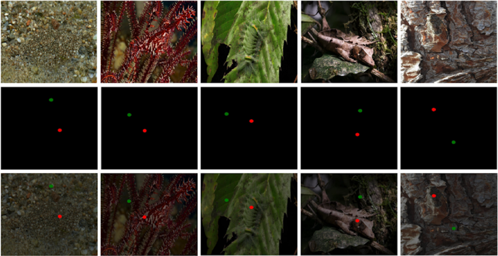

# HPGT_WSCOD 
# A Holistically Point-guided Text Framework for Weakly-Supervised Camouflaged Object Detection
> Authors: Tsui Qin Mok*, Shuyong Gao*, Haozhe Xing, Miaoyang He, and Wenqiang Zhang (* joint first authors)

Paper Link: [arxiv](https://arxiv.org/pdf/2501.06038)


# Prerequisites 
- Python 3.6
- Pytorch 1.7
- TensorboardX
- OpenCV 3.4
- Numpy 1.19


  
# Clone repository
```
git clone git@github.com:moktsuiqin/HPGT_WSCOD.git
cd HPGT_WSCOD
```


# Download P2C-COD and TCOD Dataset

* Point supervised P2C-COD dataset: [Google Drive](https://drive.google.com/drive/folders/1zm8QLs2_sV3E-LEltWRsG2iflA_Tfv26?usp=sharing)
* Text supervised TCOD dataset: [Google Drive](https://docs.google.com/spreadsheets/d/1rFq52foZamSHvRV9ZnxDW2tiFbyIC8Od/edit?usp=sharing&ouid=102988334467510152621&rtpof=true&sd=true)


# Pretrained model
The pretrained model weights can be found below:
* Segment Anything (SAM): [SAM](https://drive.google.com/drive/folders/1_2mkcbnvxBapYc2cCqF7GZrxcVJpKCAU?usp=sharing)
* Grouding DINO (GD): [GroundingDino](https://drive.google.com/drive/folders/1_2mkcbnvxBapYc2cCqF7GZrxcVJpKCAU?usp=sharing)
* CLIP (CLIP): [CLIP](https://drive.google.com/drive/folders/1_2mkcbnvxBapYc2cCqF7GZrxcVJpKCAU?usp=sharing)
* DINO ViT (ViT): [DINO-ViT](https://drive.google.com/drive/folders/1_2mkcbnvxBapYc2cCqF7GZrxcVJpKCAU?usp=sharing)


# Trained Model and Results
* Trained model weights: [Google Drive](https://drive.google.com/drive/folders/1_2mkcbnvxBapYc2cCqF7GZrxcVJpKCAU?usp=sharing)
* CAMO: [Google Drive](https://drive.google.com/drive/folders/1JmCMew0MGBprrHAb5aQ9jmTfGhKOADBE?usp=sharing)
* CHAMELEON: [Google Drive](https://drive.google.com/drive/folders/1AKXaK74qqPKndneXjI95wVsMjrxmrisv?usp=sharing)
* COD10K: [Google Drive](https://drive.google.com/drive/folders/19iSGWmLxOA2GzFP0s071OBwAALvPnXzX?usp=sharing)
* NC4K: [Google Drive](https://drive.google.com/drive/folders/1IWjzN1eeB5EnzgxlD7pe8trWC8HoCEqs?usp=sharing)

